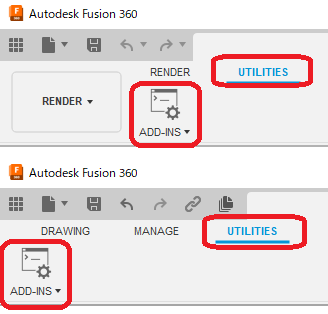
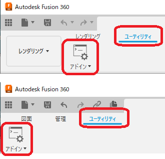

# ***Fusion360 AddScriptsManagerCommand***
This is an add-in for the Autodesk software Fusion360.

Add a Utilities tab and an Add-Ins panel to the Rendering , Drawing workspace to make it easier to run scripts.

---

## **Installation**:

To install, download/extract the zip file and register the "AddScriptsManagerCommand" folder as an **add-in**.

To register add-ins, follow the instructions [here](https://knowledge.autodesk.com/support/fusion-360/troubleshooting/caas/sfdcarticles/sfdcarticles/How-to-install-an-ADD-IN-and-Script-in-Fusion-360.html).

---

## **Usage**:

After launching the add-in, the "Utilities" tab and "Add-Ins Panel" will be added to the rendering , drawing workspace.

---

## **Attention.** :

This add-in will be discontinued once it is added as a standard feature.

---

## **Action** :

The following environment is confirmed.

- Fusion360 Ver2.0.16265
- Windows10 64bit Pro , Home

---

## **License**:
- Apache License 2.0

---

# *** 以下は日本語です。***

---

これは、オートデスクソフトウェア「Fusion360」のアドインです。

スクリプトを実行しやすくする為、レンダリングと図面ワークスペースにユーティリティタブとアドインパネルを追加します。

---

## **インストール**:

インストールする際は、zip ファイルをダウンロード/展開後 "AddScriptsManagerCommand" フォルダを **アドイン** として登録してください。

アドインの登録は、[こちら](https://kantoku.hatenablog.com/entry/2021/02/15/161734)の手順に従ってください。

---

## **使用法**:

アドイン起動後は、レンダリングと図面ワークスペースに"ユーティリティ"タブと"アドインパネル"が追加されます。

---

## **注意** :

標準機能で追加されるようになれば、本アドインは廃止します。

---

## **アクション** :

以下の環境で確認しています。

- Fusion360 Ver2.0.16265
- Windows10 64bit Pro , Home

---

## **ライセンス**:
- Apache License 2.0

---

## **謝辞** :

- [日本語フォーラム](https://forums.autodesk.com/t5/fusion-360-ri-ben-yu/bd-p/707)の皆さん、ありがとう。
